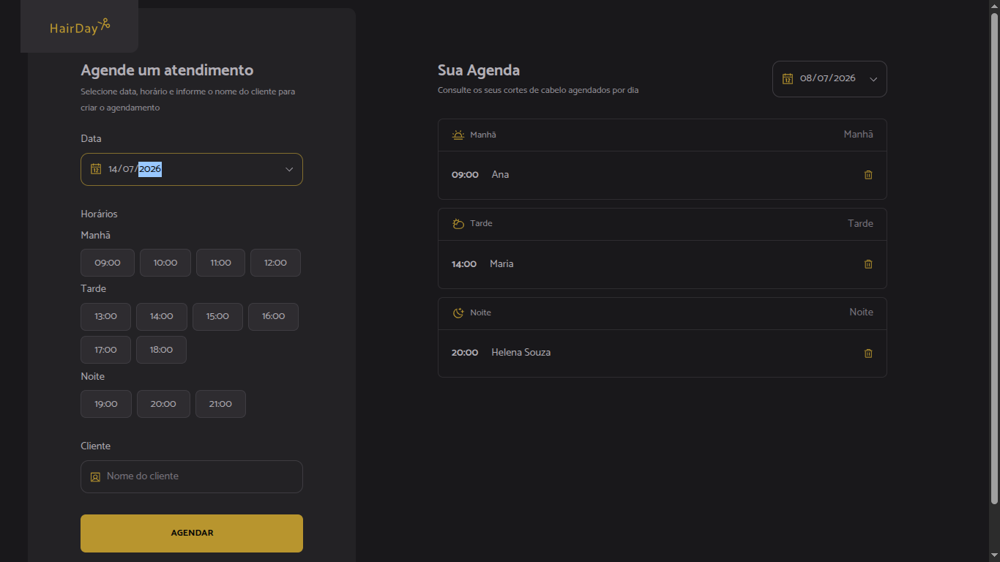

# Hairday

Hairday é uma aplicação web para gestão de agendamentos de serviços em uma barbearia ou salão de beleza. A interface permite visualizar horários disponíveis, organizar o calendário e acompanhar os compromissos de forma prática.

## 📸 Preview



## ✨ Funcionalidades

- Visualização de agenda por período
- Organização de horários e atendimentos
- Interface responsiva para desktop e mobile
- Experiência moderna com React, TypeScript e Vite

## 🛠️ Tecnologias utilizadas

- React
- TypeScript
- Vite
- Tailwind CSS
- Phosphor Icons

## ▶️ Instalação

1. Clone o repositório:
   ```bash
   git clone <url-do-repositorio>
   cd hairday
   ```

2. Instale as dependências:
   ```bash
   pnpm install
   ```

3. Inicie o servidor de desenvolvimento:
   ```bash
   pnpm dev
   ```

4. Abra o navegador em:
   ```bash
   http://localhost:5173
   ```

## 🧪 Build para produção

Para gerar a versão otimizada da aplicação, execute:

```bash
pnpm build
```

## 📄 Licença

Este projeto é de uso educacional e pode ser adaptado conforme necessário.
